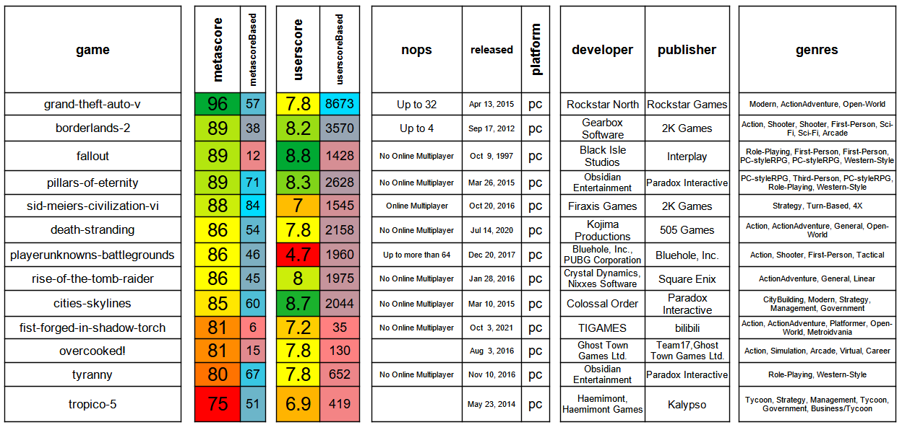

# epic-ratings
Lookup (e.g. metacritic-) ratings for all (most of) my epicgames licenses. 

# quickstart

    python3 downloader.py
    python3 filesparser.py
    open metacritic/MyEpicGamesOnMetacritic-*.csv

N.B.: see [external packages](#external-packages) below.

1. Run with the included [example file](PurchaseHistory_plaintext.txt), to see what it does: [example output](output/output.txt)
1. Read the `settings.py` to understand how the tweaking works.

# individualize
1. Use your own `PurchaseHistory_plaintext.txt` file.
1. Extend the exceptions in `settings.py` if needed (and possibly submit a pull-request to this repo)

# external packages

    pip3 install -r requirements.txt

but better do all this in a [venv](https://packaging.python.org/en/latest/guides/installing-using-pip-and-virtual-environments/#installing-virtualenv), to keep your host system unaffected.

# example result

Running 'quickstart' with the included `PurchaseHistory_plaintext.txt` example, the resulting CSV file can be sorted and formatted like ^ this, e.g. with the [example file](output/MyEpicGamesOnMetacritic.ods) and the free and opensource [LibreOffice Calc](https://www.libreoffice.org/discover/calc/). 

# Thank you very much, ...
... *metacritic*. You are an amazing website (I have actually begun using you like IMDb for all my movie ratings). Please see this "[niceness](https://github.com/drandreaskrueger/epic-ratings/blob/e18431b3446f723b48d08e48c3d1ce0f52129ce5/settings.py#L109-L114)" idea to keep the drain on your server resources minimal. Is `1.0 seconds delay` good enough?